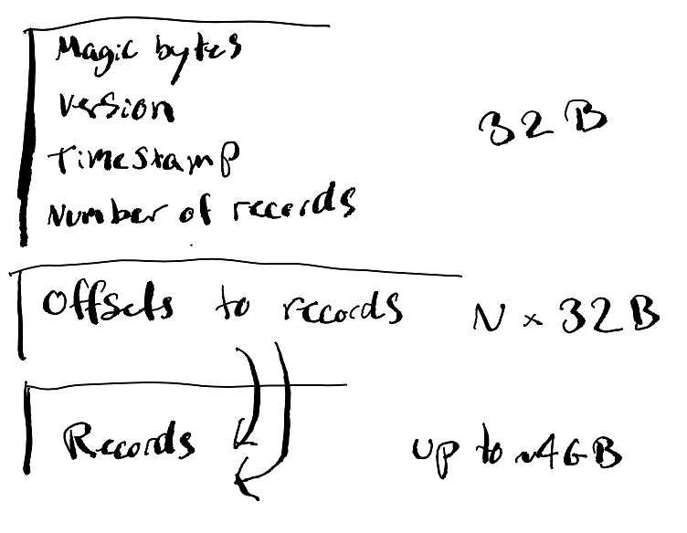
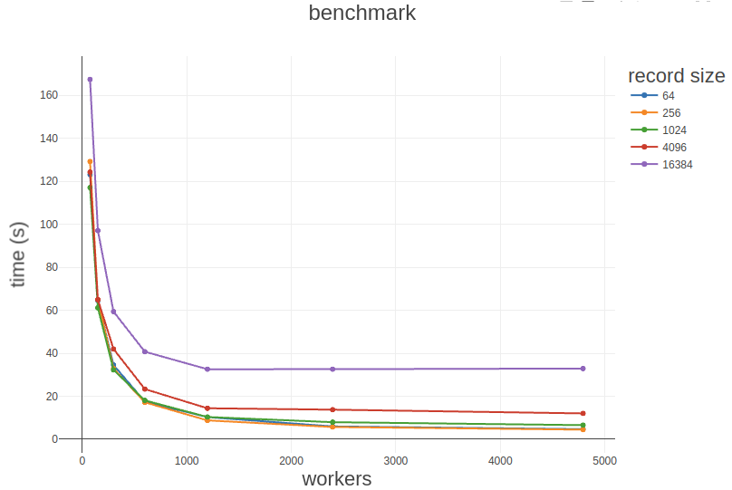
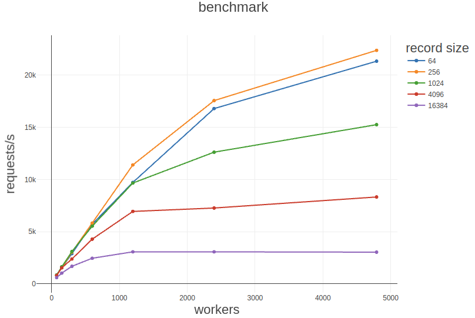
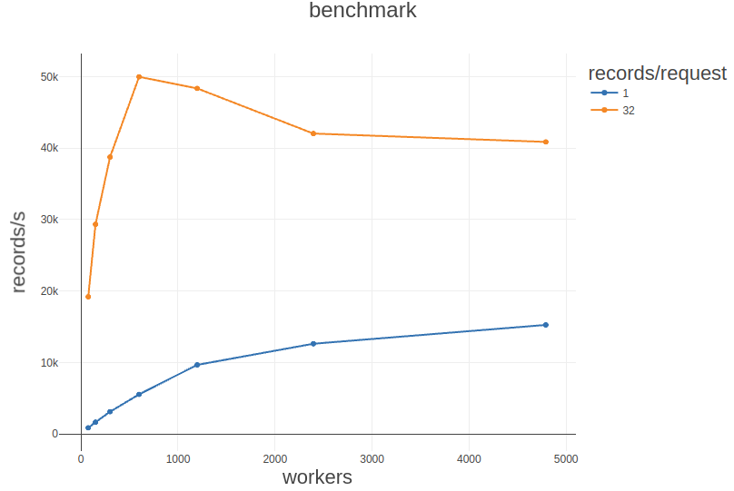

## Intro
For various side projects I've worked on, I've wanted to introduce event queues in order to simplify some things. Normally, I just go with the "one DB to rule them all", and shove things into Postgres. Sometimes though, the workload becomes too much and the burst- and credit balance of my puny RDS instances start looking like ski slopes that would kill most skiers.

Every time this has happened I've looked into hosting or renting actual event queuing systems, but never found anything that fit the bill: dedicated event queuing systems are built to scale to insane workloads with the smallest latency possible and, to me at least, they all either seemed like a handful to self-host or were too expensive to rent. I just needed something that would not lose my data if the VM and/or its disk died, something that would run on tiny, cheap hardware, and was able to put up with a reasonable amount of load. I took some time off recently and thought a fun way to spend some of this time would to be to build a system that matches these requirements. 

So, I started work on [Seb](https://github.com/micvbang/simple-event-broker) (Simple Event Broker. Yay naming!)

## Goals and status

Seb is an event broker designed with the goals of being 1) cheap to run 2) easy to manage 3) easy to use, in that order. It actually has "don't lose my data" as the very-first goal on that list, but I wanted a list of three, and I thought not losing data reasonably could be assumed to be table stakes. Let's call it item 0.

Seb explicitly does not attempt to reach sub-millisecond latencies nor scale to fantastic workloads. If you need this, there are systems infinitely more capable, designed for exactly these workloads, and which handles them _very_ well. See Kafka, Red Panda, RabbitMQ et al. 

In order to reach the goals of being both cheap to run and easy to manage, Seb embraces the fact that writing data to disk and _ensuring that data is actually written and stays written_ is rather difficult. It utilizes the hundreds of thousands of engineering hours that were poured into object stores and pays the price of latency at the gates of the cloud vendors. For the use cases I have in mind, this trade-off is perfect; it gives me reasonable throughput at a (very) low price.

I expect the target audience for a system like this will be small and niche. Who knows? Maybe there's more people like me that need event queues but aren't rich enough to rent them! 

Anyway, working on Seb has been a lot of fun and it solves exactly the problem I was looking to solve. It's by no means "done" yet (is anything ever?), but it's currently in a state where I can use it for what I need to. There's of course loads of stuff I'd love to add and improve; only supporting a single, static API-key for authentication, for instance, is laughable. But things take time and this is how far I've come.

## Architecture

Although Seb doesn't have a clever play on words including "go" in its name, it's written in Go. I kinda want to evolve it to be embeddable (even easier to manage when it lives _inside_ your application!), but for now I've hidden everything from the public in the `internal/` folder so that I don't have to play nice with anyone that might be foolish enough to try and use it just yet. It's currently _very_ actively under development, and I might change anything at any time. Force-push-to-master kind of active; be warned!

Seb is split into three main parts; the *[Broker](https://github.com/micvbang/simple-event-broker/blob/master/internal/sebbroker/broker.go#L27)*, which is responsible for managing and multiplexing Topics, *[Topic](https://github.com/micvbang/simple-event-broker/blob/master/internal/sebtopic/topic.go#L38)* which are responsible for persisting data to the underlying storage, and *[Cache](https://github.com/micvbang/simple-event-broker/blob/master/internal/sebcache/cache.go#L22)*, which is responsible for caching data locally so that we can minimize the number of times we pass through the gates of the cloud vendors, saving both latency and cash money. This is shown below.


The Broker assumes that data is durably persisted when a Topic's `AddRecords()` method returns. As might be legible from my doodles above, Topic currently has three different backing storages: [S3](https://github.com/micvbang/simple-event-broker/blob/master/internal/sebtopic/s3storage.go#L21), [local disk](https://github.com/micvbang/simple-event-broker/blob/master/internal/sebtopic/diskstorage.go#L16), and [local memory](https://github.com/micvbang/simple-event-broker/blob/master/internal/sebtopic/memorystorage.go#L17). S3 is the only one that anyone should trust with production data (remember I said that writing to disk is hard?). Disk and memory are super-duper only to be used for data that you don't care about. Pinky-promises required before use!

The simple but important realization I had when initially trying to design Seb on paper was that if I can trust the cloud vendors's object stores that a file is durably stored once they've given me a 200 OK, the hardest part of the system (besides concurrency?) wouldn't have to be handled by me. With this assumption it's a non-event interms of durability if my VM or local disk dies during operation. The data lives on in the skies and no caller believes that they have added data to the queue which wasn't actually added. Argument for why this last part is true coming right up!

## Durability and latency-money trade-off

In order to not have to wait a full roundtrip every time we write data to S3 (and to save money on the $0.005-per-1,000-requests of S3!) we collect records in batches before sending them off to S3. Whenever "the first" record of a batch comes in the door, Seb will wait for a configurable amount of time in the hope that more records will arrive and can be included in the batch. Callers are blocked while waiting for the batch to finish. This is a very direct trade-off between money and latency, and your specific situation will dictate how long time it makes sense to wait. Once the wait time has expired, Seb will attempt to write the accumulated records to S3. Only when we've gotten our response from the S3 API do we tell the callers whether their request succeeded or not. If it succeeded we send them the offset of their record, and if not we send them an error. This is _it_. The main argument that Seb won't lose our data. There's of course still a lot of other ways that things can go wrong, but, in terms of durability, this is the central argument: Seb only tells callers that their data has been persisted once it has gotten a 200 OK from S3. 

You might have noticed that it's still possible that Seb will crash in the time between getting a 200 OK from S3 and replying to the caller. In this situation the data _has_ been added to the queue, and can be retrieved by consumer, but the caller has no way of knowing. So, if the caller really cares about adding their data to the queue, they will retry the call and the data will be added twice. In fancy systems lingo we would say that the producer has "at-least-once" delivery semantics. This problem is somewhat easily circumvented: if producers include a unique id in each record, consumers can use this to ignore records they've already handled. This would of course also be possible to handle this directly in Seb, but would require that all producers include a unique ID for every record, and that Seb has some way of keeping track of which IDs that were already added. In order to keep Seb simple, this is not a goal.

The strategy for batching records is configurable and hidden behind the [RecordBatcher](https://github.com/micvbang/simple-event-broker/blob/master/internal/sebbroker/broker.go#L17) interface. The strategy described above is implemented as [BlockingBatcher](https://github.com/micvbang/simple-event-broker/blob/master/internal/sebbroker/blockingbatcher.go#L39). There's also a batching strategy called [NullBatcher](https://github.com/micvbang/simple-event-broker/blob/master/internal/sebbroker/nullbatcher.go#L12) which doesn't do any batching, and just send records straight through to S3, creating and uploading one file per record. This is mostly useful for testing.

## Data layout

The data format used in a system like this can have a large impact on read and write performance. I initially looked around for existing file formats to use but didn't manage to find any that would be particularly helpful. Instead, I came up with the simplest and stupidest file format that I thought would work, which would be fast and simple to both write and parse. I started out being kinda inspired by LSM trees, but since I've yet to implement support for record keys, I've done nothing of the sort. It's just a tiny header concatenated with pointers into raw record data. Oh, and files are immutable, so they're infinitely cacheable and only ever have to be "constructed" once.

This is what the format looks like:



As I've tried to show in the visualization, the file format has three sections: 
1) header (32 bytes)
2) pointers to each record (N * 32 bytes)
3) record data (however much data the records are)

For anyone that has tried to come up with a custom file format before, one of the things you're likely to learn the hard way is that you should include a version number in the header. It's unlikely we'll get the file format right in the first try, and adding a version number will give us the opportunity to change the format in the future while keeping the parsing code compatible with versions without too many hacks; read the header and do dispatch based on the version number.


The static part of the [header](https://github.com/micvbang/simple-event-broker/blob/master/internal/sebrecords/records.go#L24) is declared as follows:

```go
type Header struct {
	MagicBytes  [4]byte
	Version     int16
	UnixEpochUs int64
	NumRecords  uint32
	Reserved    [14]byte
}
```

It weighs in at 32 bytes and dictates that each file can contain a maximum of 2^32 files (`NumRecords` is uint32). Each offset into the file is given as a uint32, so the maximum offset into the file we can point to is 4GB. Both of these numbers are obviously _way_ larger than we are likely to want to use in practice. We want to keep the size of each file reasonably small so that it's not too expensive to fetch it from S3 if we don't have it in the local cache, but at the same time we don't want it to be too small because this would mean that we have to go to S3 more often. Trade-offs everywhere! 


## Benchmarking

This post has already become way too long. If you're still reading: well done! We're almost through. If you're out of breath and need to take a break: I hear you. Go lie down. But, if you want to finish this before doing so, I've written a summary TLDR below. If you don't want the spoiler, quickly cover your secreen and scroll past the following handful of lines!

**TLDR Summary**

- Hardware: Hetzner CAX11, 2 core ARM Ampere, 4GB memory
- Seb configuration: batch collection time: 10ms
- Each test sends 100k records
- Requests are sent from T14 laptop on fiber in Copenhagen, Denmark to CAX11 in Falkenstein, Germany

- Max performance non-batched: 22k requests/s with 4800 workers (1 record/request)
- Max performance batched*: 50k requests/s with 600 workers (32 records/request)


Now that I've spent some time building and discussing Seb, I thought it would be nice to understand how it behaves if we put it under a bit of stress. These benchmarks aren't going to be particularly scientific. I'm aiming for getting an overall feeling for what this thing can do, not winning benchmark of the year. Each test in the following data was run just once, so you don't have to look at those pesky error bars. Yes, I know. You're welcome.


Since Seb was designed to be cheap to run, I wanted to try it out on a cheap machine. At €4.51/month, Hetzner's CAX11 ARM VMs are exactly what I'm looking for. They come with 2 ARM Ampere cores and 4GB memory. Hetzner provide no specs on their disks, but do state the following

> They are optimized for high I/O performance and low latency and are especially suited for applications which require fast access to disks with low latency, such as databases.

I expect the latency to AWS to be the dominating factor in this test anyway, so the performance of the disk shouldn't matter _too much_.

Since we're going for speed in these benchmarks, I decided to set the batch collection time low at 10ms. This means that, whenever the first request comes in, Seb will collect all incoming requests for the next 10ms into a batch. Once the batch is collected, Seb writes it to a file and sends it to S3 before putting it into the local disk-cache.

An important detail: since Seb blocks callers while collecting a batch, we have to send a lot of HTTP requests in parallel in order to be able to saturate the system.

### Graphs and numbers

The first graph we're going to look at is runtime vs number of workers for different payloads. 



We see that it's faster to use more workers, but that the returns of adding more workers start diminishing at around 1200. I speculate that our small 2-core server starts to buckle at the knees because of the overhead of handling the overhead of that many HTTP connections simultaneously.

On the above graph we also see that it's generally slower to send requests with larger payloads, but that requests of size <= 1024 bytes are roughly the same. This makes sense since we're aren't even filling up our ethernet packets at this point.

The next graph is requests/second vs workers for different record sizes.




Here, we see the maximum number of requests/second hit ~20k for record sizes 64 and 256 bytes. I can't come up with a reason why 256 bytes should be faster than 64, so I'm going to assume that this is just noise. After all, we are running this on a shared VM and giving it a bit of a hard time. See, I promised: no error bars!

Starting at 1200 workers, we see that the requests/second drops by roughly half with a quadrupling of the record size. This is another indication to me that we have found the point at which we're starting to confuse our hardworkig CAX11 with the sheer number of requests we're sending to it. If _only_ the record size had been the bottle neck, I would expect the number of requests/second to drop by something closer to a factor of four. Another way to look at this: ~3000 requests/second at 16kb/request is around 375 mbit/s, whereas at ~7k requests/second at 4kb/request is around 220 mbit/s. Even though the number of requests is much lower, we're still pushing almost double the amount of data through with out 16kb payload. The record size does seem to have an impact, though, which we can see from how the graphs flatten out a lot quicker for the higher record sizes.

I didn't really plan to benchmark any further, but after finding that we're probably saturating the server with the _number_ of requests rather than the amount of data we're pushing through, I decided to do one more benchmark. This time, I'm using Seb's batch API, which allows us to queue multiple records per request.

The final graph shows us records/second vs workers, for batch sizes of 1 and 32 with a record size of 1kb.




As we would expect from our above analysis, the graph shows that the number of records/second increases dramatically records are batched. On the graph, we also see that the system starst to deteriorate at 1200 workers. This matches our previous observations. I believe that main difference now is that we're actually not just pushing it on the _amount of requests_, but also with the amount of work that has to be done per request. The system simply can't keep up anymore, and starts to become slower.


## TODOs and missing features

There's still a bunch of things I'd love to work on to improve Seb. I've spent too much time writing the above, so I'll just outline the TODOs and missing features in a bullet list below. Perhaps some of these will be the topic of another post?

- Authentication
	- currently only supports a single, deployment-wide API key
	- considering: certificate-based authentication

- keep state
	- probably sqlite
  - track consumer offsets
  - track record keys

- record keys
	- compaction
	- history of values for key
	- iterate over all keys

- clean up old data
	- LSM compaction (requires record keys)
